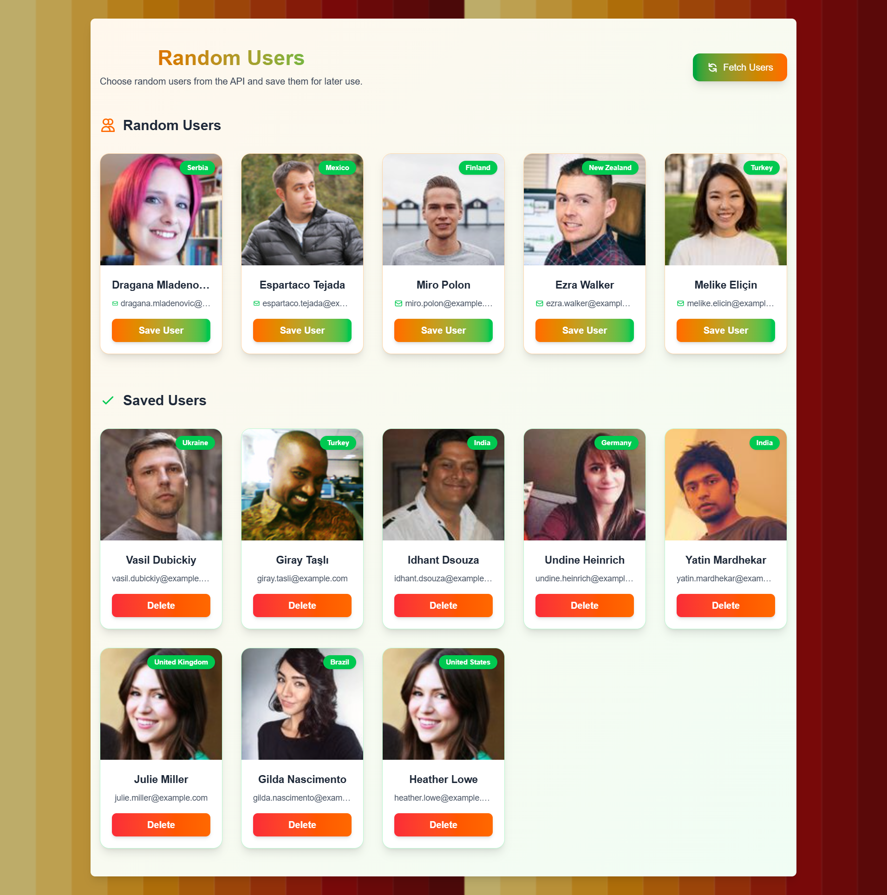

# Random Users App

A React application that fetches and displays random users from an API with the ability to save and manage favorites.



## Features

- Fetch random users from [Random User API](https://randomuser.me/)
- Display user cards with a clean and modern design
- Save favorite users
- Delete saved users
- Smooth animations using Framer Motion
- Fully responsive layout for all screen sizes
- Elegant color palette with gradient from orange to green

## Technologies Used

- React.js
- Framer Motion (for animations and transitions)
- Tailwind CSS (for styling)
- Vite (as the build tool)

## How to Run Locally

1. Clone the repository:
   ```bash
   git clone https://github.com/Abdallah-Mushtaha/React-Training-Zone.git
   ```
2. Navigate to the project directory:

   ```bash
   cd Another_Api_Task
   ```

3. Install the dependencies:

   ```bash
   npm install
   ```

4. Start the development server:

   ```bash
   npm run dev
   ```

5. Open your browser and go to:
   ```bash
   http://localhost:5173
   ```
